# BitMEX NinjaTrader Adapter

NinjaTrader supports third-party plugins to integrate market data with their desktop software
platform.

BitMEX offers access live market data. The BitMEX plugin does not support trading or any
transactions. It only provides market data for research and testing purposes.

- [Installation](#installation)
- [Usage](#usage)
  * [Connecting](#connecting)
  * [BitMEX data](#bitmex-data)
    + [Live quotes](#live-quotes)
    + [Order book](#order-book)
    + [Historical quotes](#historical-quotes)
      - [Notes on charting](#notes-on-charting)
    + [News](#news)
    + [Hotlists](#hotlists)
    + [Strategy Analyzer](#strategy-analyzer)
- [Uninstallation](#uninstallation)
- [Troubleshooting](#troubleshooting)
  * [No Market Data](#no-market-data)
  * [Empty Chart](#empty-chart)
- [Developers](#developers)

## Installation
1. Download the latest [NinjaTrader-BitMEX Release.](https://github.com/BitMEX/ninjatrader-bitmex/releases) You want the release zip, not source zip or tar.
2. Launch NinjaTrader
3. From the menu, select Tools > Import > NinjaScript Add-On

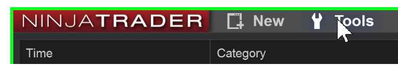

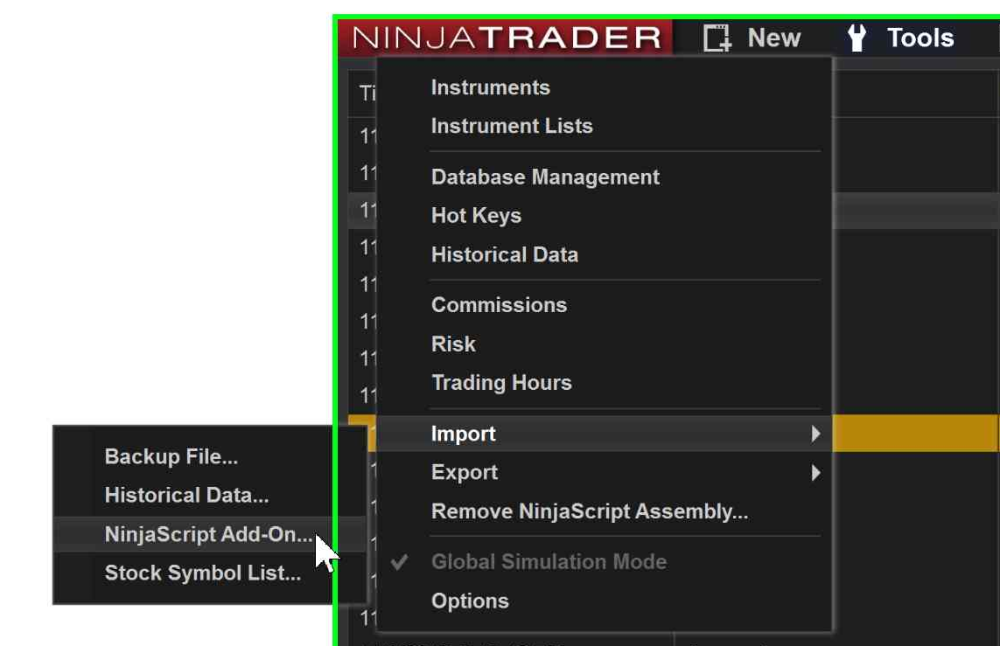

4. Select the zip file downloaded in step 1
5. Restart NinjaTrader

## Usage

### Connecting
Once your plugin is installed, you need to set up the connection to BitMEX. This only needs to be
done once. Launch NinjaTrader, and from the menu select Connections > Configure.

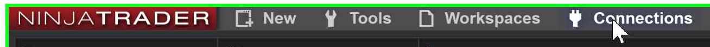

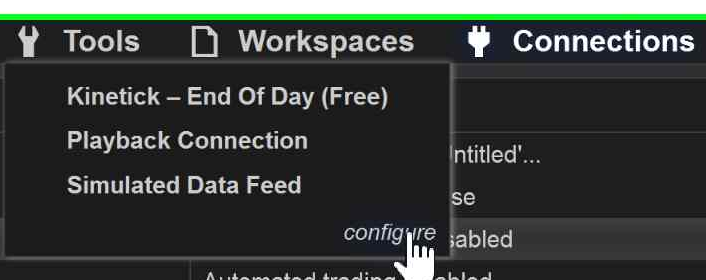

You should see an entry in the Available pane for BitMEX. Select it and click Add in the
Configured pane. You can name the connection if you wish in the Properties pane.

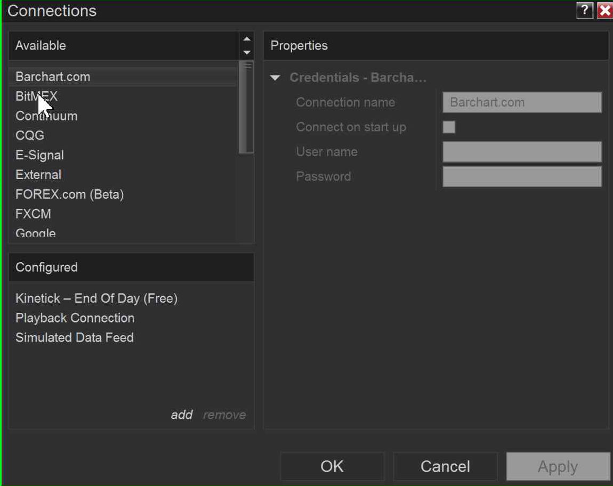

A username and password **are required by NinjaTrader**, but are not used by BitMEX. You can set any
values, for example "test" and "test".

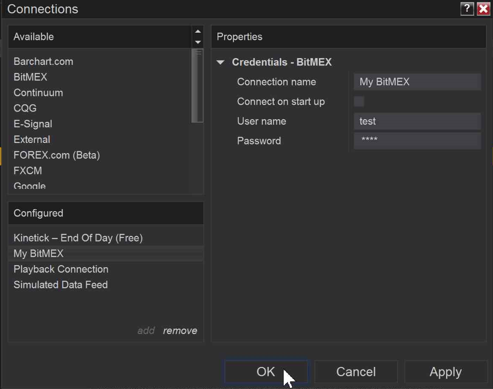

Click OK to save your connection and exit. Now when you click on the Connections menu item, you
should see an option for BitMEX. Click on it to connect.

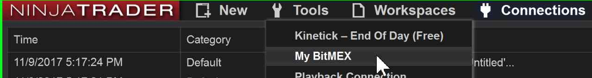

### BitMEX data
BitMEX offers several types of data for NinjaTrader research. The following items are available:

- Live quotes
- Order book
- Historical quotes
- News
- Hotlist
- Strategy Analyzer

To view any of the above, you need to connect NinjaTrader to BitMEX's data feed.

NinjaTrader allows creating lists of instruments. To create a list for BitMEX instruments,
in the menu go to Tools > Instrument Lists. In the left pane of the dialog, click Add and type
the name of your list. Instruments can then be added to the list by name. Available BitMEX
instruments can be viewed by opening Tools > Instruments and filtering by "BitMEX".

> Note: NinjaTrader does not support all of BitMEX's contract names.

> NinjaTrader does not support numbers in symbol names, so for futures like `XBTZ17`, you
need to use the format SYMBOL MM-YY, where MM and YY are the two-digit month and year the
contract expires. The year is the two digits at the end of the BitMEX symbol, 2017 in the case of
`XBTZ17`. The month is designated by the letter immediately before the year, Z in this case. For
a list of month codes, see [BitMEX's futures documentation.](https://www.bitmex.com/app/futuresGuideExamples#Futures-Month-Codes)

> For relisting futures such as ETC7D, replace the suffix with "WKLY" for weekly futures or "DLY"
for daily futures. For example, ETC7D becomes ETCWKLY.

#### Live quotes
To view live quotes for any symbol traded on BitMEX, click on New in the menu and select Basic
Entry or Market Analyzer. For Basic Entry, simply enter your symbol in the Instrument box. For
Market Analyzer, right click in the window and select Add Symbol. Multiple symbols can be added
in this way.

#### Order book
To view the order book for a symbol traded on BitMEX, click on New in the menu and select
Level II. Right click in the window that appears and select Instruments > the symbol you are
interested in. The window does not need to be refreshed, updates will automatically be streamed
from BitMEX.

#### Historical quotes
To plot past BitMEX data, from the menu select New > Chart. In the window that appears, enter
your symbol and hit enter.

Data can be viewed in 1 minute or 1 day bins. To select bin size, go to the properties pane,
go to the Data Series section and choose Minute or Day in the Type dropdown.

You can choose the date range in the Time Frame section of the Properties pane.

##### Notes on charting
BitMEX API requests are rate limited. If you specify a very wide date range, it may take a long time for the data to be returned.

For futures instruments, NinjaTrader overrides the symbol entered in NinjaTrader's UI and
substitutes another month based on your date range. This can result in NinjaTrader fetching the
wrong symbol, or returning no data for your query.

To turn off this behavior, go to Tools > Options > Market Data and set Global Merge Policy to Do
Not Merge.

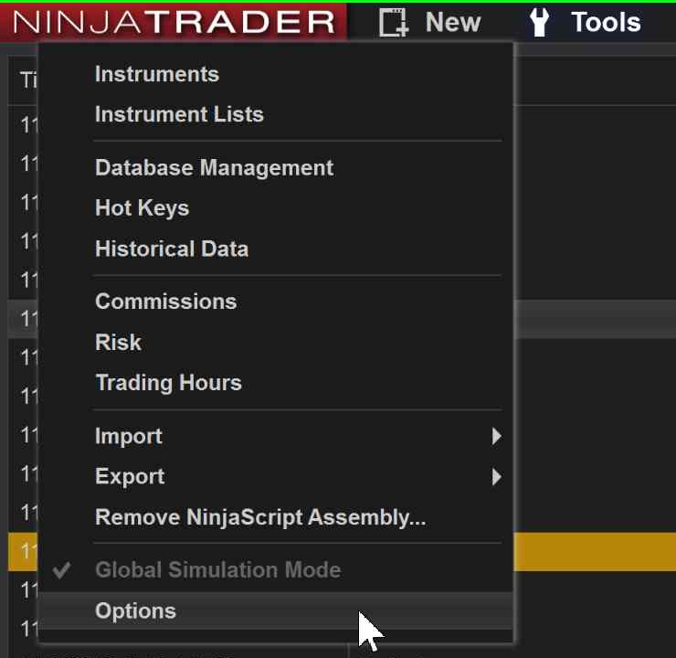

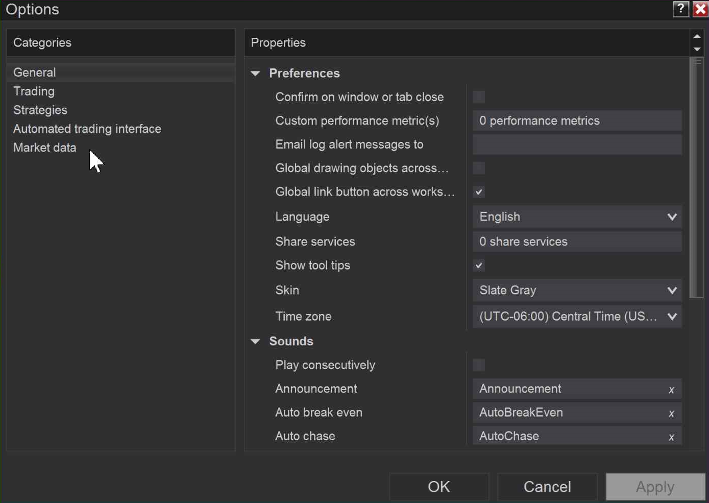

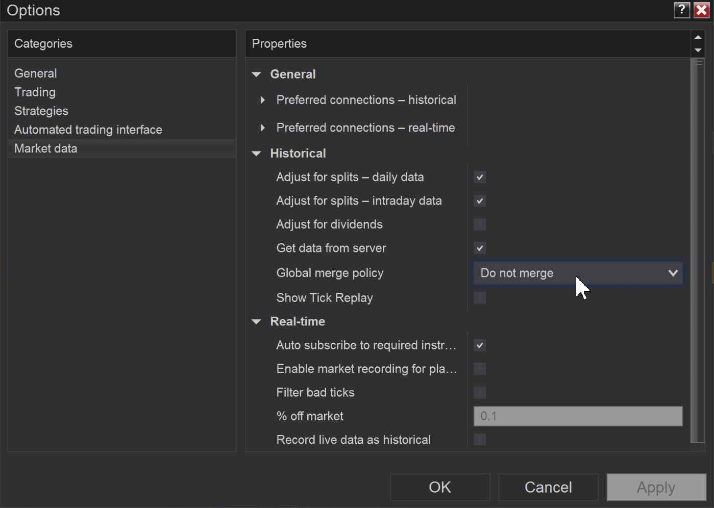

#### News
To view news items from BitMEX, from the top menu select New > News. Items will be automatically
streamed from BitMEX.

#### Hotlists
Hotlists are a set of related instruments, for example highest volume or biggest percentage
gainers. BitMEX currently supports one hotlist, the instruments with the greatest turnover for the
last 24 hours.

To view the BitMEX hotlist, in the menu select New > Hot List Analyzer. In the window that appears,
select Highest Turnover from the dropdown.

#### Strategy Analyzer
To run a strategy analysis, from the top menu select New > Strategy Analyzer. Select the instrument,
strategy type, and time frame you want and click Run.

## Uninstallation

To remove the BitMEX plugin from NinjaTrader, go to Tools > Remove NinjaScript Assembly.
Remove both `BitmexConnect` and `websocket-sharp`. It takes a few seconds to remove each;
wait for the first to finish before removing the second.

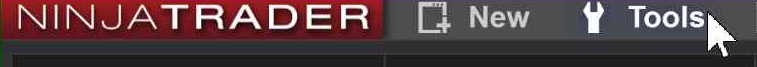

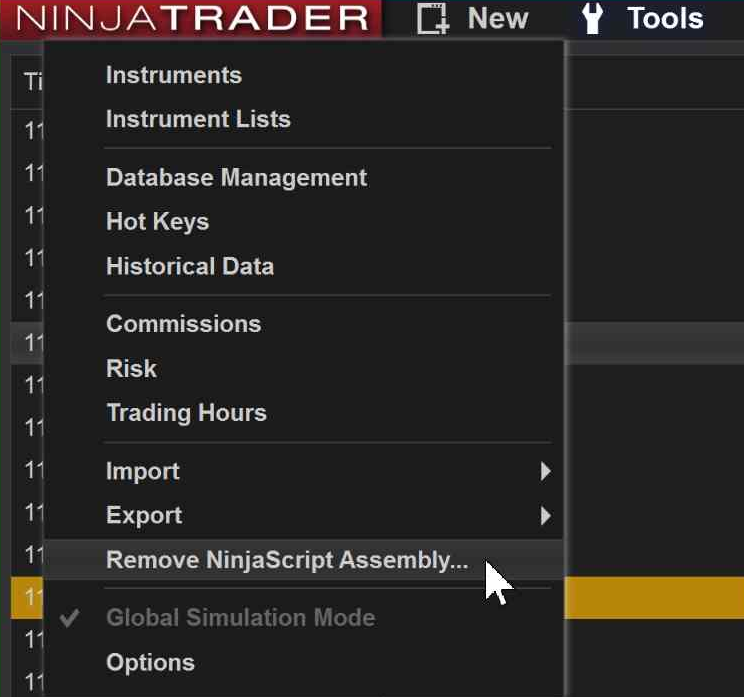

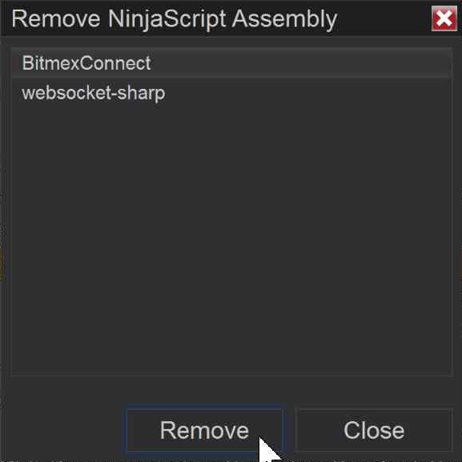

## Troubleshooting

### No Market Data
If you're not receiving data in any windows, double check your BitMEX connection is configured
correctly and you are connected.

### Empty Chart
If you're charting prices for a futures contract, check the setting in Tools > Options >
Market Data. The setting for Global Merge Policy should be Do Not Merge.
